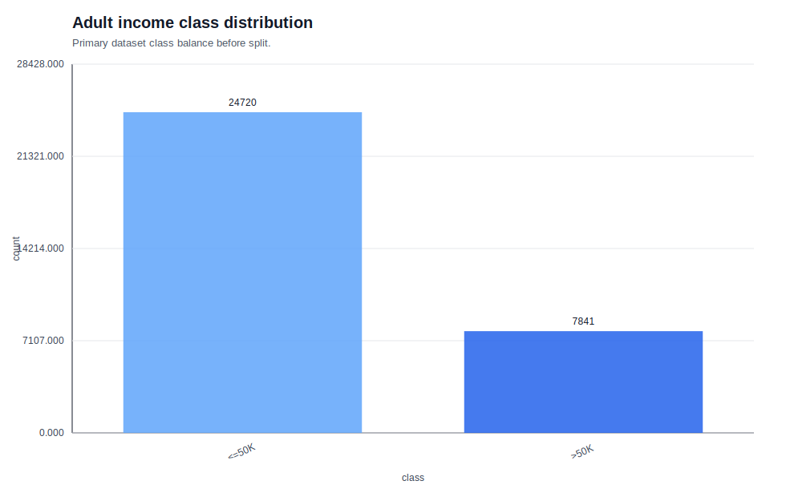
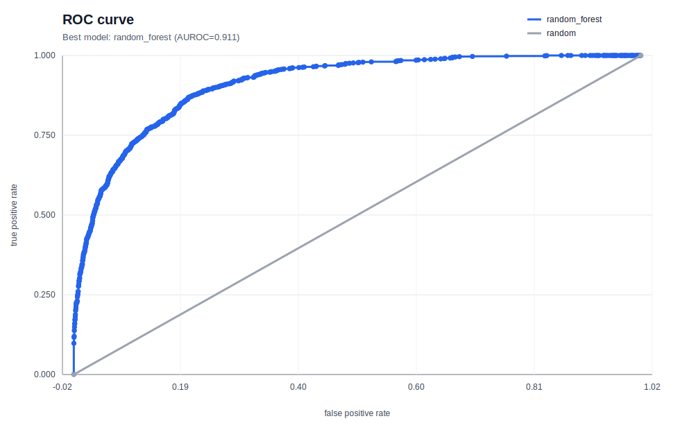
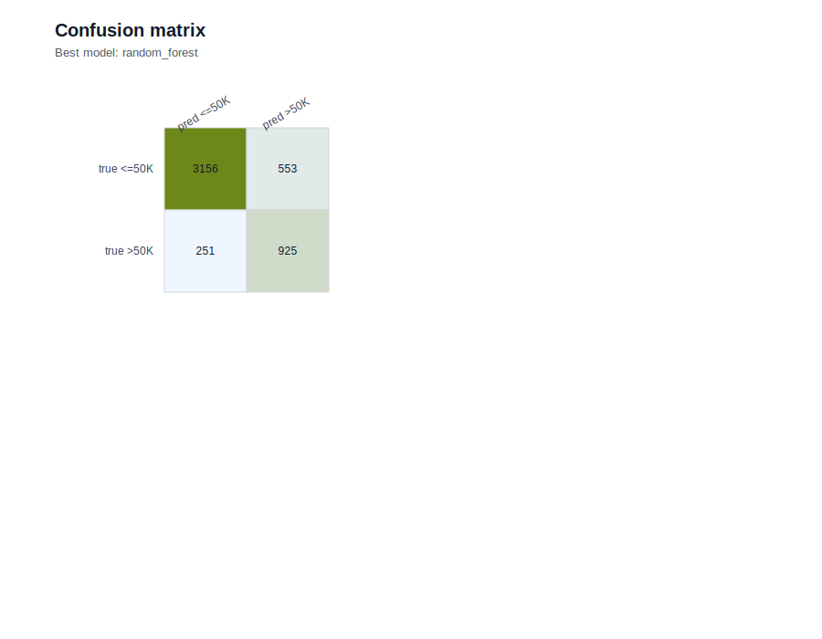
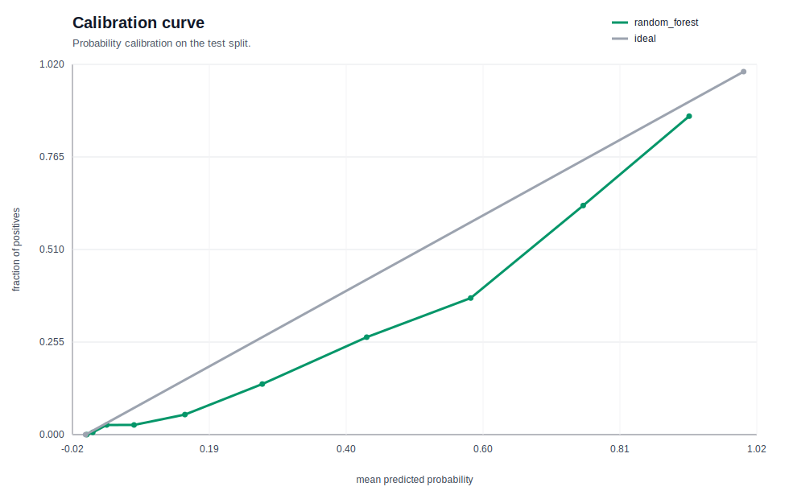
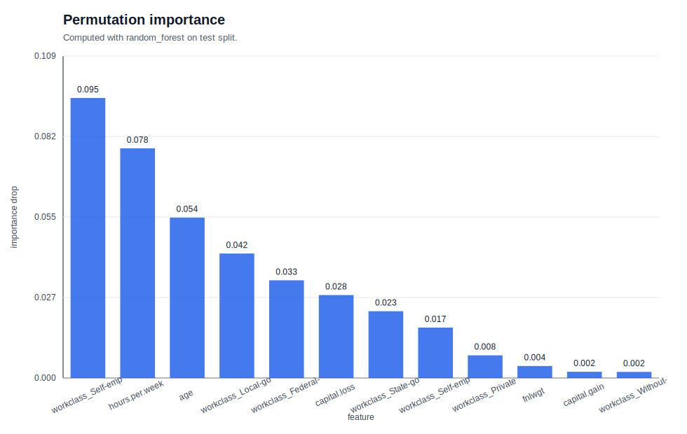
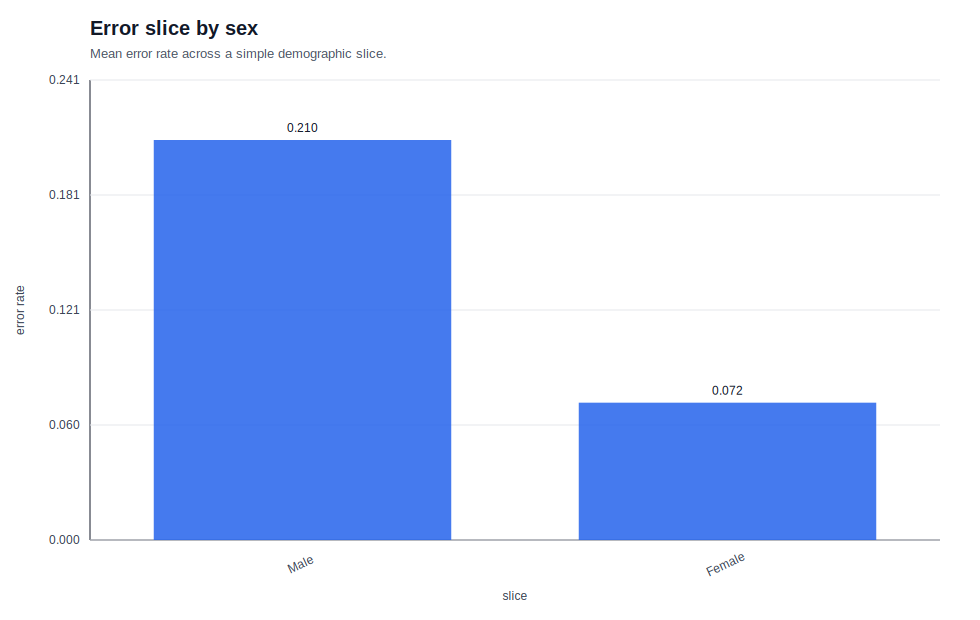
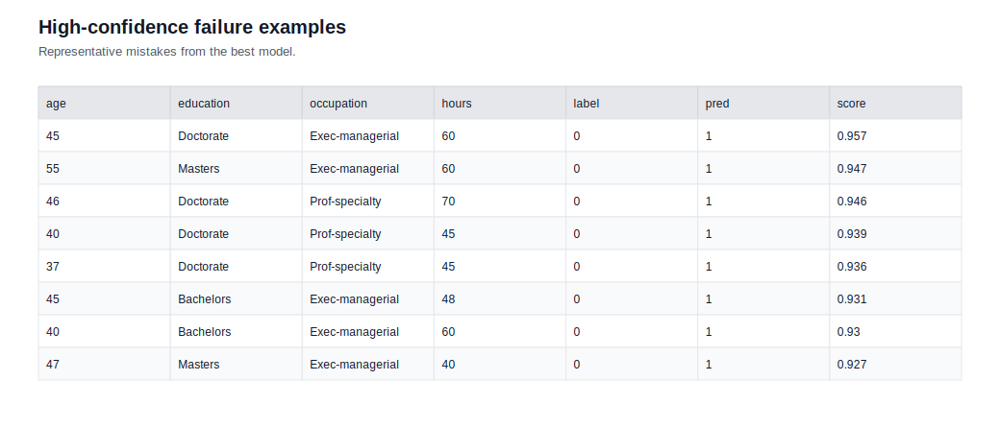

# 01. 표형 분류 결과 리포트

## 이 실험을 왜 읽어야 하는가

이 문서는 Adult Census Income 분류 실험의 숫자를 나열하는 리포트가 아니다.
`classification`이 실제로 어떤 판단 문제인지, 왜 accuracy 하나로는 충분하지 않은지, 왜 AUPRC·AUROC·F1·calibration을 함께 읽어야 하는지를 **실제 결과에 붙여서 공부하는 노트**다.

- stage 가이드: [README](../../README.md)
- 자세한 이론: [THEORY](../../THEORY.md)

## 한 줄 결론

- 최고 모델: `random_forest`
- 핵심 수치: `AUPRC=0.7834`, `AUROC=0.9105`, `F1=0.6971`, `Accuracy=0.8354`
- 요약 해석: positive class 가 희소한 Adult 데이터에서는 threshold 기준 정답률보다 **positive 를 얼마나 앞쪽에 올려놓는지**가 더 중요했고, 그 점에서 `random_forest` 가 가장 안정적이었다.

## 실험 설계 요약

1. 데이터셋: `scikit-learn/adult-census-income`
2. split: stratified train / valid / test
3. 전처리: `?` 정규화, numeric median imputation, categorical most-frequent imputation, one-hot encoding
4. 비교 모델: `dummy_prior`, `logistic_regression`, `random_forest`, `gpu_mlp`
5. 대표 질문:
   - positive class 가 적을 때 baseline accuracy 는 얼마나 속이는가?
   - 선형 baseline 과 tree ensemble 의 차이는 어디서 드러나는가?
   - GPU MLP 는 tabular 에서 정말 강한가?
   - 고확신 오답은 어떤 샘플에 몰리는가?

## 모델 비교표

| 모델 | AUPRC | AUROC | F1 | ACCURACY | FIT_SEC |
| --- | --- | --- | --- | --- | --- |
| `random_forest` | 0.7834 | 0.9105 | 0.6971 | 0.8354 | 1.70 |
| `logistic_regression` | 0.7657 | 0.9044 | 0.6724 | 0.8055 | 4.36 |
| `gpu_mlp` | 0.7569 | 0.9021 | 0.6851 | 0.8510 | 4.48 |
| `dummy_prior` | 0.2407 | 0.5000 | 0.0000 | 0.7593 | 0.00 |

## 메트릭을 어떻게 읽어야 하는가

- **Accuracy**: threshold 를 하나 정했을 때 전체 정답 비율이다. 클래스가 불균형하면 쉽게 높아 보인다.
- **F1**: precision 과 recall 의 균형을 본다. positive class 를 놓치지 않는지 볼 때 중요하다.
- **AUROC**: threshold 전반의 ranking 품질을 본다. 다만 불균형이 심할 때는 민감도가 떨어질 수 있다.
- **AUPRC**: 희소한 positive class 를 얼마나 잘 끌어올리는지 본다. 이번 실험의 핵심 메트릭이다.
- **Calibration curve**: score 0.9 를 준 샘플이 정말 90% 정도 맞는지 본다.

## 결과 해석

### 1) 왜 `random_forest` 가 가장 좋았나

Adult 데이터는 `education`, `occupation`, `marital.status`, `hours.per.week`, `capital.gain` 같은 변수들이 단순 선형으로 묶이지 않는다.
`random_forest` 는 이런 비선형 상호작용을 더 잘 잡아 주기 때문에 AUPRC 와 AUROC 에서 가장 안정적인 결과를 냈다.

### 2) 왜 `gpu_mlp` 는 accuracy 가 더 높은데도 AUPRC 는 낮았나

이건 **label accuracy 와 score ranking 이 다른 문제**라는 뜻이다.
MLP 는 threshold 기준 예측에서는 강했지만, positive class 를 높은 순서로 배치하는 안정성은 `random_forest` 보다 떨어졌다.

### 3) 고확신 오답은 어디에 몰렸나

- 성별 분포: {'Male': 29, 'Female': 1}
- 상위 오답 학력: {'Bachelors': 11, 'Masters': 9, 'Doctorate': 5}
- 평균 나이: 44.9
- 평균 근무시간: 47.9

즉, 모델은 **고학력 + 장시간 근무 + 전문/관리 직군**을 강한 고소득 신호로 읽는 경향이 있었고, 이 archetype 에서 벗어나는 예외 샘플을 고확신으로 틀렸다.

## figure 읽기 가이드

### 결과 figure

- 클래스 불균형이 얼마나 큰지 보여 준다. baseline accuracy 를 해석할 때 출발점이 된다.

- 이번 실험의 핵심 figure 다. positive class 를 잘 끌어올릴수록 곡선이 우상단에 붙는다.

- score ranking 전반의 품질을 본다. PR curve 와 같이 봐야 해석이 안전하다.

- FP/FN 의 균형을 직접 보여 준다. threshold 에서 어떤 종류의 실수가 많은지 읽는다.

- confidence 를 얼마나 믿을 수 있는지 본다. 상승 추세가 있더라도 high-confidence error 가 남는지 함께 봐야 한다.

### 분석 figure

- 모델이 실제로 어떤 feature 를 자주 사용하는지 보여 준다.

- 전체 평균이 가리는 slice disparity 를 본다.

- confidence 가 올라갈수록 실제 정답률이 같이 올라가는지 확인한다.

- 숫자만 보면 안 보이는 failure archetype 을 직접 확인한다.

## 다음에 볼 것

1. validation set 에서 threshold tuning 을 하면 F1 이 얼마나 바뀌는가?
2. calibration 을 보정하면 high-confidence error 를 줄일 수 있는가?
3. `hist_gbdt` 같은 boosting 계열을 넣으면 ranking 품질이 더 올라가는가?
4. sex 외에 age / occupation slice 에서 어떤 차이가 추가로 드러나는가?
