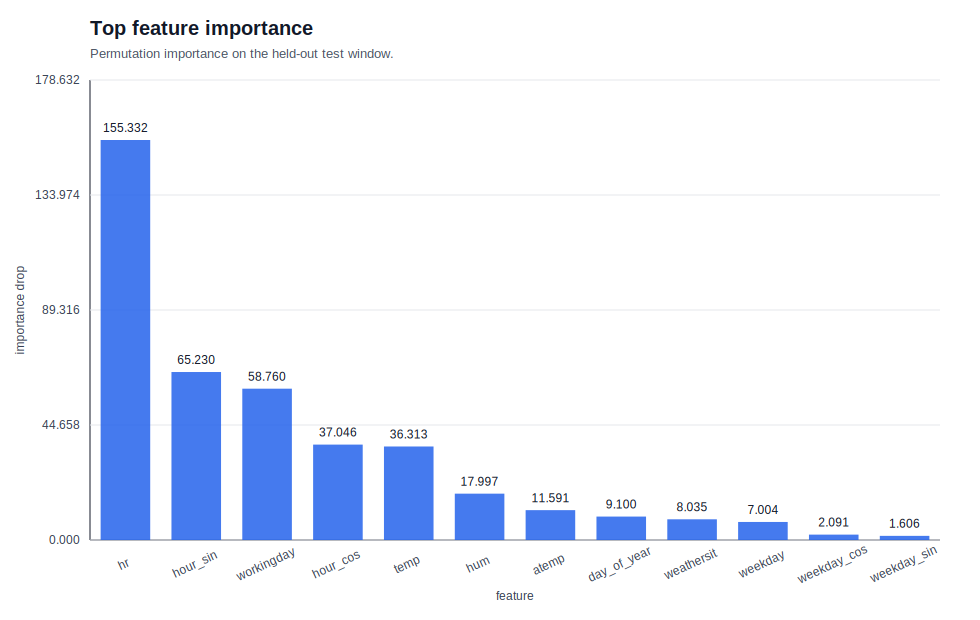
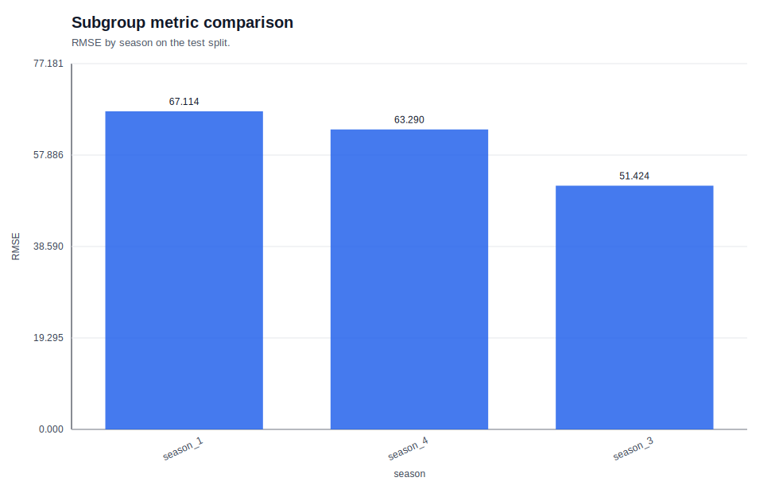
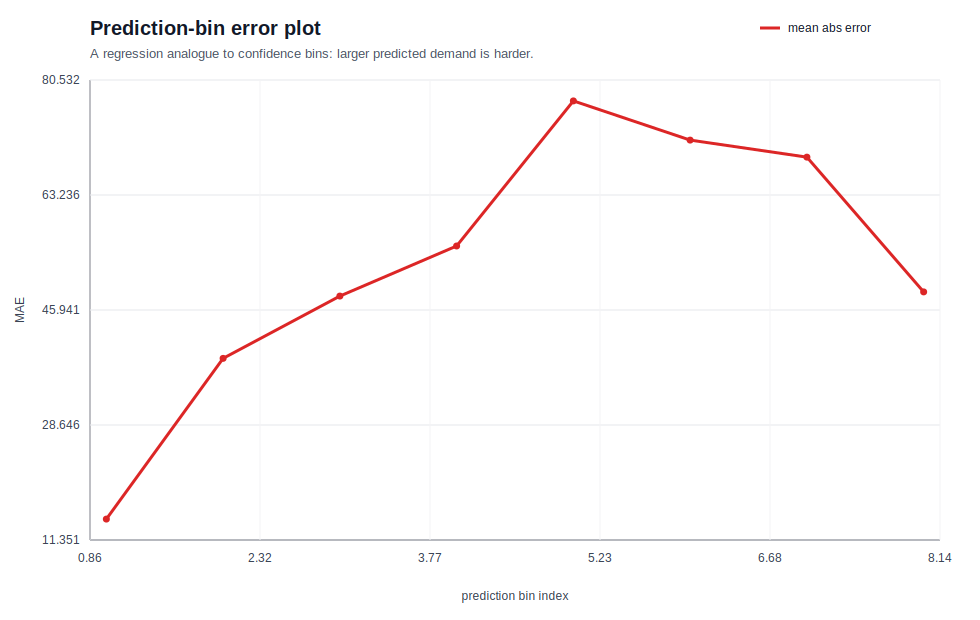

# 03. 모델 선택과 해석 결과 노트

## 한 줄 결론

- 과제: Bike Sharing 시간축이 있는 count 회귀
- 최고 모델: `tuned_hist_gbdt`
- 핵심 지표: `RMSE=60.0516`, `MAE=38.1593`, `R2=0.9258`
- 해석: 시간축을 보존한 validation이 이 문제에 맞는 방식이었고, tuned HGBDT가 peak 수요와 시간 패턴을 가장 안정적으로 잡았다.

---

## 이론과 연결해서 먼저 읽기

이 리포트는 [상위 이론 문서](../../THEORY.md)를 먼저 읽고 내려오면 훨씬 잘 보인다.

이론 문서에서 먼저 챙길 문장은 다음이다.

- random split은 시간 데이터에서 leakage를 만들 수 있다.
- `TimeSeriesSplit`은 과거로 학습하고 미래로 검증하게 만든다.
- model selection은 평균 점수만이 아니라 분산과 안정성까지 본다.
- interpretation은 평균 뒤에 숨은 failure slice를 드러낸다.

---

## 왜 이런 실험 설계를 했는가

이번 실험은 “점수 하나”를 뽑는 실험이 아니라, **시간 데이터에서 모델을 어떻게 골라야 하는지**를 확인하는 실험이다.

### 실험 순서

1. 시간 순서를 보존한 train/test split을 만든다.
2. Poisson baseline으로 최소 기준을 잡는다.
3. `HistGradientBoostingRegressor` 후보를 `TimeSeriesSplit`으로 비교한다.
4. `validation curve`로 복잡도 방향을 확인한다.
5. GPU MLP를 비교군으로 추가한다.
6. best model을 test window에서 최종 평가한다.
7. permutation importance와 slice analysis로 실패를 해석한다.

### 이 설계가 해결하는 문제

- random split의 낙관적 점수 착시를 막는다.
- fold별 분산을 통해 모델의 안정성을 본다.
- 평균 성능과 운영 리스크를 함께 읽게 한다.
- 다음 실험 가설을 slice 단위로 세울 수 있게 한다.

---

## 모델 비교

| 모델 | RMSE | MAE | R2 | FIT_SEC |
| --- | --- | --- | --- | --- |
| tuned_hist_gbdt | 60.0516 | 38.1593 | 0.9258 | - |
| poisson_baseline | 163.1814 | 120.1109 | 0.4522 | - |
| gpu_mlp | 164.3160 | 109.0213 | 0.4446 | - |

### 읽는 법

- `tuned_hist_gbdt`가 평균 성능과 안정성 모두에서 우세했다.
- `poisson_baseline`은 구조가 단순해서 peak와 상호작용을 충분히 못 잡았다.
- `gpu_mlp`는 학습은 되지만 tabular + 시간 패턴 문제에서는 tree boosting보다 덜 안정적이었다.

---

## CV에서 왜 이 후보가 이겼는가

`tuned_hist_gbdt`의 후보 비교는 다음과 같다.

| 후보 | params | mean_rmse | std_rmse |
| --- | --- | --- | --- |
| candidate_1 | `learning_rate=0.08, max_leaf_nodes=31, min_samples_leaf=20, max_iter=160` | 67.6508 | 12.4027 |
| candidate_2 | `learning_rate=0.05, max_leaf_nodes=63, min_samples_leaf=20, max_iter=220` | 70.4737 | 15.1867 |
| candidate_3 | `learning_rate=0.03, max_leaf_nodes=127, min_samples_leaf=30, max_iter=280` | 74.1568 | 18.9147 |

이 결과는 다음 메시지를 준다.

- 복잡도를 높인다고 항상 좋아지지 않는다.
- 시간-aware CV에서는 평균뿐 아니라 분산도 중요하다.
- candidate_1이 가장 낮은 평균 RMSE와 가장 작은 분산을 보여 줬다.

---

## 결과를 해석할 때 꼭 봐야 하는 그림

### 1) CV fold RMSE boxplot

- `TimeSeriesSplit`에서 fold별 RMSE가 어떻게 흔들리는지 본다.
- candidate_1이 가장 안정적인 쪽에 가깝다.

### 2) validation curve

- `max_leaf_nodes`를 바꾸었을 때 평균 CV RMSE가 어떻게 변하는지 본다.
- 이 그림은 과소적합/과적합 균형을 읽는 데 쓰인다.

### 3) top feature importance

- 모델이 실제로 무엇을 많이 쓰는지 보여 준다.
- `hr`, `hour_sin`, `workingday`, `hour_cos`, `temp`가 핵심이었다.

---

## 해석 그림: 평균 뒤에 숨어 있는 실패

### subgroup metric comparison

- season별 RMSE를 비교하면 전체 평균 뒤의 계절 차이를 볼 수 있다.
- 이번 리포트에서는 `season_1=67.114`, `season_4=63.290`, `season_3=51.424`로 차이가 보였다.
- 즉, 계절별 난이도가 같지 않다.

### prediction-bin error plot

- regression 버전의 confidence bin 해석이다.
- 예측값이 큰 구간으로 갈수록 MAE가 커진다.
- 고수요 구간일수록 더 어렵다는 뜻이다.

### common failure slice summary

- workingday와 weather 조합에서 오차가 가장 많이 모이는 구간을 보여 준다.
- 운영 관점에서는 이 그림이 가장 중요하다.

---

## observed failure slice: 실제로 어디가 무너졌나

아티팩트와 요약 파일을 함께 보면 실패는 다음 구간에 집중된다.

### workingday × weather 조합

| workingday | weather | MAE | 해석 |
| --- | --- | --- | --- |
| 0 | 3 | 73.30 | 가장 어려운 구간이다. 악천후 범주에서 오차가 크게 벌어진다. |
| 1 | 3 | 64.58 | 평일이어도 악천후면 오차가 여전히 크다. |
| 0 | 2 | 44.63 | 날씨가 조금만 나빠져도 오차가 증가한다. |
| 0 | 1 | 38.36 | 휴일/주말이라도 정상 날씨면 상대적으로 낫다. |
| 1 | 2 | 37.60 | 평일+보통 날씨는 중간 수준이다. |
| 1 | 1 | 32.04 | 가장 안정적인 쪽에 가깝다. |

### peak 시간대

요약 파일의 worst-case 분석에서는 오차가 주로 다음 시간대에 몰렸다.

- 상위 시간대 분포: `{8: 9, 18: 4, 17: 4}`
- 상위 날씨 분포: `{3: 11, 1: 10, 2: 9}`
- 평균 실제 수요: `441.4`
- 평균 예측 수요: `401.6`

이 패턴은 모델이 전체 평균은 괜찮게 맞추지만, **출퇴근 peak를 낮게 보는 보수적 예측**을 한다는 뜻이다.

### slice 해석 메모

- 오전 8시와 저녁 17~18시는 수요가 몰린다.
- 악천후가 겹치면 오차가 더 커진다.
- 평균 RMSE 하나만 보면 이 위험이 잘 보이지 않는다.

---

## feature importance가 말해 주는 것

`top_feature_importance.svg`의 permutation importance는 다음 feature가 핵심이었음을 보여 준다.

- `hr`: `155.332`
- `hour_sin`: `65.230`
- `workingday`: `58.760`
- `hour_cos`: `37.046`
- `temp`: `36.313`
- `hum`: `17.997`
- `atemp`: `11.591`
- `day_of_year`: `9.100`
- `weathersit`: `8.035`
- `weekday`: `7.004`

읽는 포인트는 단순하다.

- 시간대 정보가 가장 강하다.
- 주기형 시간 표현이 큰 역할을 한다.
- workingday와 weather가 peak를 흔든다.
- 기온/습도 같은 기상 변수도 중요하지만, 시간대 신호보다 한 단계 아래에 있다.

---

## 왜 tuned HGBDT가 최종 선택이었나

이번 문제는 tabular + 시간 패턴 + 비선형 상호작용 조합이다. 이런 문제에서 tree boosting은 다음 이유로 강하다.

- hour 같은 변수를 split으로 잘 다룬다.
- workingday, weather, temp의 상호작용을 자연스럽게 포착한다.
- peak처럼 국소적으로 튀는 구간을 MLP보다 안정적으로 잡는 경우가 많다.
- `validation curve`와 CV boxplot으로 복잡도를 직접 조절하기 쉽다.

반면 Poisson baseline은 구조가 너무 단순해서 peak와 상호작용을 충분히 못 잡고, GPU MLP는 표현력은 있지만 tabular 문제에서 tree boosting만큼 안정적이지 않았다.

---

## 다음 가설

이번 리포트는 끝이 아니라 다음 실험의 출발점이다.

1. lag feature를 추가하면 peak 수요 예측이 좋아지는가?
2. holiday / working day / weather interaction을 명시적으로 넣으면 악천후 slice가 개선되는가?
3. target log transform 또는 다른 count-friendly loss를 쓰면 tail error가 줄어드는가?
4. 출퇴근 시간대만 별도 모델로 분리하면 peak miss가 줄어드는가?
5. 더 많은 fold로 검증하면 모델 안정성 차이가 더 분명해지는가?

---

## 결론 메모

이번 실험의 핵심은 “점수 하나”가 아니라 **왜 이 모델을 골랐고, 어디서 틀렸으며, 다음에 무엇을 실험할지**를 설명할 수 있는가이다.

이번 Bike Sharing 실험은 그 구조를 잘 보여 준다. tuned HGBDT가 평균 성능과 안정성에서 가장 좋았고, 실패는 주로 악천후와 출퇴근 peak에 몰려 있었다. 따라서 다음 실험은 peak 대응과 slice 개선에 초점을 맞춰야 한다.
