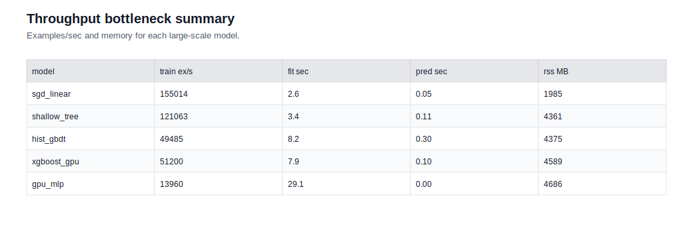
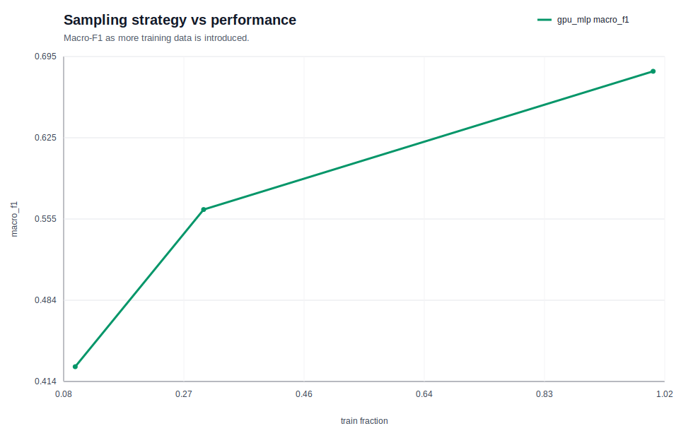

# 04. 대규모 표형 데이터 실험 노트

이 문서는 Covertype 대규모 다중분류 실험을 **이론 → 실험 설계 → 지표 → 실패 분석 → 다음 가설** 순서로 읽기 위한 학습 노트다. 숫자만 빠르게 훑는 보고서가 아니라, 왜 macro metric과 비용 지표를 같이 봐야 하는지까지 이해하는 문서로 읽으면 좋다.

## 먼저 읽을 문서

- [이 stage 소개](../../README.md)
- [이론 노트](../../THEORY.md)
- [요약본](summary.md)

## 실험 목적

이번 실험은 다음 질문에 답하려고 설계했다.

1. 선형 모델은 이 문제에서 어디까지 버틸 수 있는가?
2. tree 기반 strong baseline은 얼마나 좋아지는가?
3. GPU boosting은 품질과 속도를 동시에 끌어올리는가?
4. accuracy가 좋아 보여도 class별 실패가 남아 있는가?

## 데이터셋 메모

- 데이터셋: `mstz/covertype`
- 문제 유형: 7-class tabular classification
- 왜 이 데이터인가: class 불균형, 실험 비용, strong baseline 비교, class-wise 분석을 한 번에 연습하기 좋다.

## 실험 설정

- split: stratified train / valid / test
- baseline: `sgd_linear`, `shallow_tree`
- strong baseline: `hist_gbdt`, `xgboost_gpu`
- neural comparator: `gpu_mlp`
- primary metric: `macro_f1`
- secondary metrics: `accuracy`, `macro_recall`, `mean_confidence`, `fit_time_sec`, `predict_time_sec`, `peak_rss_mb`

## 지표를 어떻게 읽어야 하나

### macro-F1
class별 precision/recall 균형을 평균내므로, 특정 class가 심하게 무너지면 바로 떨어진다. 이 실험의 대표 지표인 이유다.

### accuracy
전체 평균을 빠르게 보여 주지만, 다수 class가 점수를 끌어올릴 수 있다. 따라서 단독 해석은 위험하다.

### macro-recall
각 class 정답을 얼마나 놓치지 않았는지 본다. class별 누락이 큰 문제에서 매우 중요하다.

### 시간/메모리 지표
성능이 좋아도 너무 느리거나 무거우면 다음 실험을 못 돌린다. 이 stage에서는 품질만큼 비용도 중요한 결과다.

## 모델 비교표

| 모델 | Macro-F1 | Accuracy | Macro-Recall | Mean Confidence | Fit Sec |
| --- | --- | --- | --- | --- | --- |
| `xgboost_gpu` | 0.9192 | 0.9377 | 0.9070 | 0.8861 | 7.94 |
| `hist_gbdt` | 0.7981 | 0.8365 | 0.7765 | 0.7849 | 8.22 |
| `gpu_mlp` | 0.7369 | 0.8383 | 0.7046 | 0.8101 | 29.13 |
| `shallow_tree` | 0.6394 | 0.7797 | 0.5806 | 0.6667 | 3.36 |
| `sgd_linear` | 0.4578 | 0.7090 | 0.4455 | 0.6960 | 2.62 |

## 결과 해석

### 왜 `xgboost_gpu`가 최고였나

`xgboost_gpu`는 macro-F1, accuracy, macro-recall이 모두 가장 높았다. 중요한 점은 이것이 단지 최고 점수라서가 아니라, fit time도 `7.94s`로 strong baseline 범위 안에 있다는 점이다. 즉, **좋은 품질을 과도한 비용 없이 얻었다**는 해석이 가능하다.

### `hist_gbdt`는 왜 strong baseline인가

`hist_gbdt`는 약한 baseline보다 훨씬 좋은 점수를 냈고, 메모리와 속도도 비교적 안정적이었다. 다만 class-wise recall 차이가 남아 있어 “충분히 강한 출발점”이지 “최종 답”은 아니었다.

### `gpu_mlp`가 준 교훈

GPU를 쓰는 신경망이라고 해서 tabular에서 자동으로 가장 좋아지지는 않았다. fit time은 길고 macro-F1은 tree strong baseline보다 낮았다. 이 결과는 **문제 구조에 맞는 모델 계열 선택이 하드웨어 사용보다 더 중요할 수 있다**는 사실을 보여 준다.

## 실패 분석

### class-wise recall

- class 4: 가장 낮은 recall (`0.8020`)
- class 6: 가장 높은 recall (`0.9584`)

이 차이는 전체 accuracy가 높아도 모든 class가 똑같이 잘 맞는 것은 아니라는 뜻이다.

### confusion pair

- `(0 -> 1)`: 2562
- `(1 -> 0)`: 1573
- `(4 -> 1)`: 257
- `(5 -> 2)`: 171
- `(2 -> 5)`: 121

특히 0/1 쌍은 dominant class끼리도 경계가 흔들린다는 것을 보여 준다. class 4는 minority 성격과 경계 난이도가 겹쳐서 더 취약해 보인다.

## Figure 읽기

### 결과 Figure

#### `metric_vs_training_time.svg`

성능이 좋아질수록 학습 시간도 같이 늘어나는지 본다. `xgboost_gpu`는 높은 macro-F1을 내면서도 학습 시간이 과도하게 길지 않았다.

#### `metric_vs_memory.svg`

더 좋은 점수를 얻기 위해 메모리를 얼마나 더 쓰는지 본다. `xgboost_gpu`가 가장 높은 품질을 냈지만 RSS도 높아, 다음 실험에서는 메모리 최적화가 과제가 된다.

#### `score_distribution.svg`

confidence 분포가 어느 구간에 몰리는지 본다. confidence가 높다고 항상 안전한 것은 아니므로 class-wise 분석과 함께 읽어야 한다.

### 분석 Figure

#### `slice_metric_by_class.svg`

class별 recall 편차를 바로 보여 준다. 이 그림이 낮은 class부터 다음 실험 가설의 출발점이 된다.

#### `throughput_bottleneck_summary.svg`

어느 모델이 시간과 메모리에서 병목이 되는지 요약한다. 점수만 높은 모델과 실험 효율이 좋은 모델을 구분할 때 유용하다.

#### `sampling_strategy_performance.svg`

데이터 양이 늘어날 때 strong baseline이 더 좋아질 여지가 있는지 본다. 성능이 계속 오르면 더 큰 데이터로 확장할 근거가 된다.

## 다음 실험 가설

1. class 0/1 경계를 더 세분화할 feature engineering을 넣어 본다.
2. class 4 recall을 올리기 위해 class-balanced loss 또는 resampling을 검토한다.
3. `xgboost_gpu`의 메모리 사용량을 줄일 수 있는 설정을 탐색한다.
4. 더 큰 HIGGS 데이터로 넘어가도 같은 문서/실험 규약을 유지할 수 있는지 확인한다.
