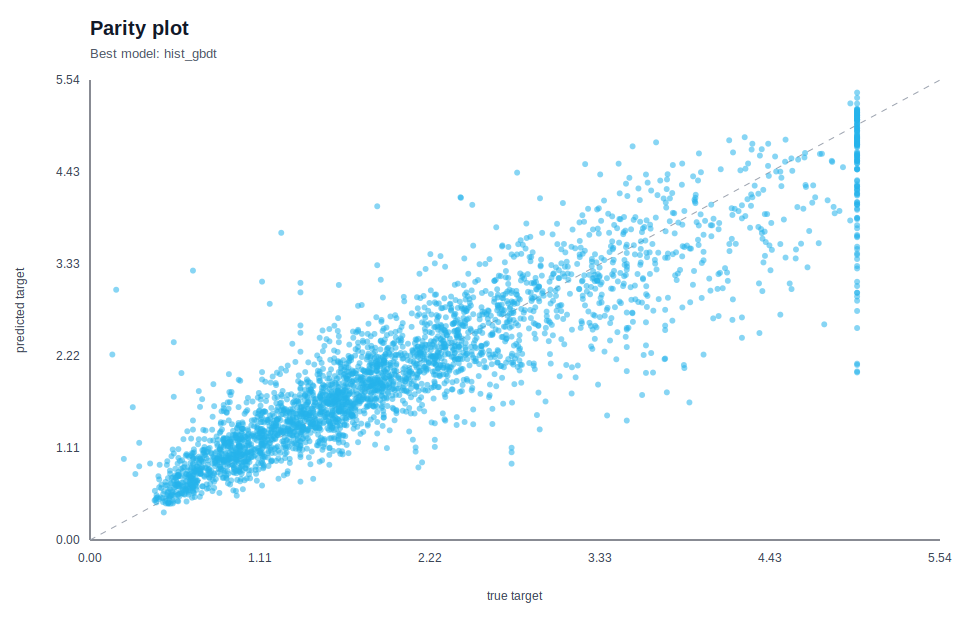

# 01 ML

이 트랙의 목표는 `표형 데이터 -> 전처리 -> baseline -> strong baseline -> metric 해석 -> failure analysis` 흐름을 몸에 익히는 것이다.
이제 `01_ml`은 별도 `reports/`, `runs/`, `scripts/` 폴더로 흩어져 있지 않고, **각 stage 폴더 안에 코드와 artifact가 함께 있는 구조**로 정리한다.

## 어디부터 보면 좋은가

1. 공통 이론: [THEORY.md](THEORY.md)
2. 전체 결과 인덱스: [RESULTS.md](RESULTS.md)
3. stage별 README / THEORY / 최신 artifact README

## 전용 conda 환경

ML 트랙은 다른 단계와 의존성이 충돌할 수 있으므로 전용 환경 `btb-01-ml` 에서 실행한다.

- 최소 환경 스펙: [env/environment.yml](env/environment.yml)
- 실제 실행 환경 lock: [env/conda-linux-64.lock.txt](env/conda-linux-64.lock.txt)
- 환경/실행 가이드: [env/README.md](env/README.md)
- 환경 생성 스크립트: `bash 01_ml/env/create_env.sh`
- 전체 실행 진입점: `bash 01_ml/run_ml_track.sh`

## 폴더 구조

각 stage 폴더는 아래 구성으로 통일한다.

- `README.md`: 이 stage를 어떻게 공부할지 설명하는 입구 문서
- `THEORY.md`: 용어, 문제 정의, metric, 모델, 데이터셋, figure 읽는 법을 설명하는 이론 노트
- `dataset.py`: stage 전용 데이터 로딩/특징 생성
- `experiment.py`: 실제 실험 흐름, 전처리, 모델 학습, figure 생성, metric 저장
- `run_stage.py`: stage 단일 실행 entrypoint
- `artifacts/<run_id>/...`: metrics / config / predictions / figures / README / summary

## 단계 구성

| Stage | 목표 | 핵심 metric | 최신 artifact |
| --- | --- | --- | --- |
| [01_tabular_classification](01_tabular_classification/README.md) | 분류 기본기 | AUPRC | [README](01_tabular_classification/artifacts/20260326-172429_adult-census-income_model-suite_s42/README.md) |
| [02_tabular_regression](02_tabular_regression/README.md) | 회귀와 residual 분석 | RMSE | [README](02_tabular_regression/artifacts/20260326-172452_california-housing_model-suite_s42/README.md) |
| [03_model_selection_and_interpretation](03_model_selection_and_interpretation/README.md) | 시간축 검증과 해석 | RMSE | [README](03_model_selection_and_interpretation/artifacts/20260326-172503_bike-sharing-hourly_tuned-hgbdt_s42/README.md) |
| [04_large_scale_tabular](04_large_scale_tabular/README.md) | 대규모 tabular 비용-성능 비교 | Macro-F1 | [README](04_large_scale_tabular/artifacts/20260326-172723_covertype_large-scale-suite_s42/README.md) |

## 실행 규칙

- stage별 코드는 각 폴더 안에서 바로 읽히도록 유지한다.
- 결과는 stage의 `artifacts/` 안에 바로 쌓는다.
- 숫자만 남기지 말고, metric과 figure 해석을 반드시 함께 남긴다.
- baseline 대비 무엇이 좋아졌는지와 어디서 틀렸는지를 같이 적는다.

실험 운영 규칙은 [../docs/01_experiment_playbook.md](../docs/01_experiment_playbook.md) 를 따른다.

## 빠르게 훑는 결과 미리보기

### 01 표형 분류

### 02 표형 회귀

### 03 모델 선택과 해석

### 04 대규모 표형 데이터

