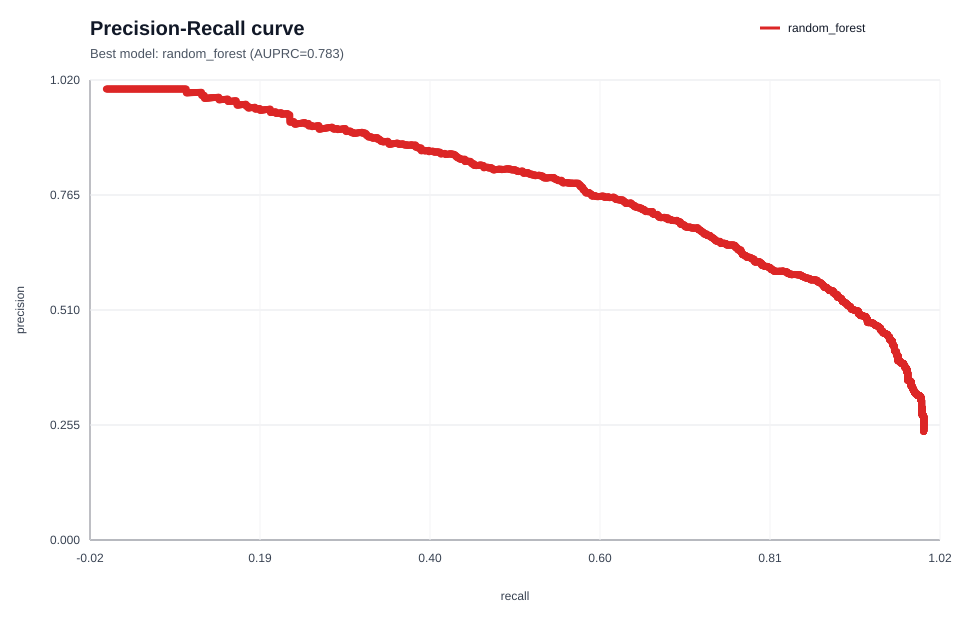
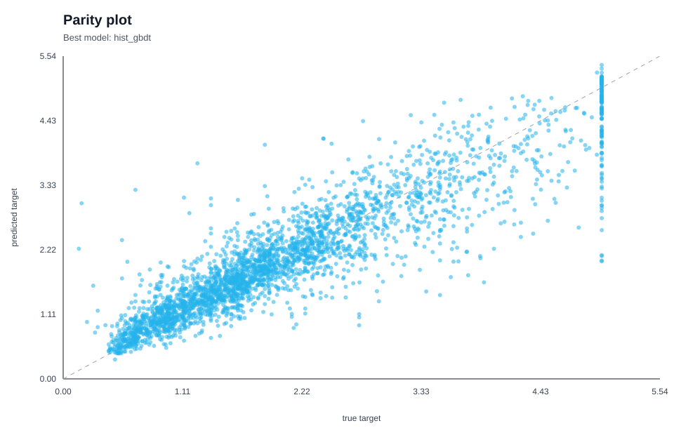
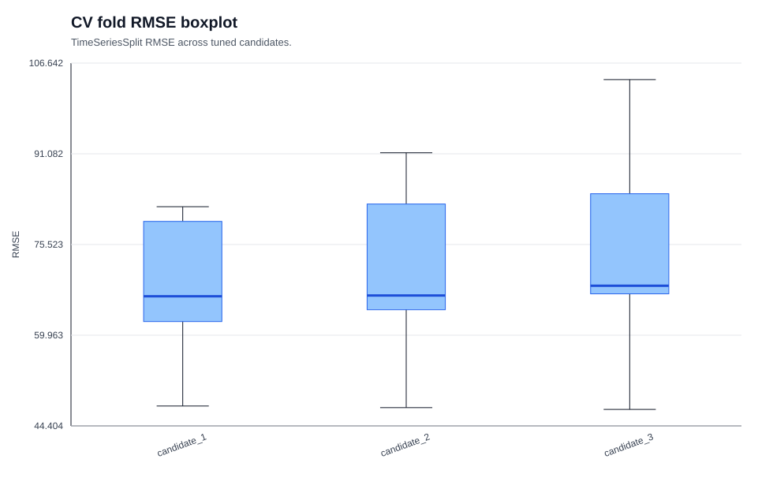
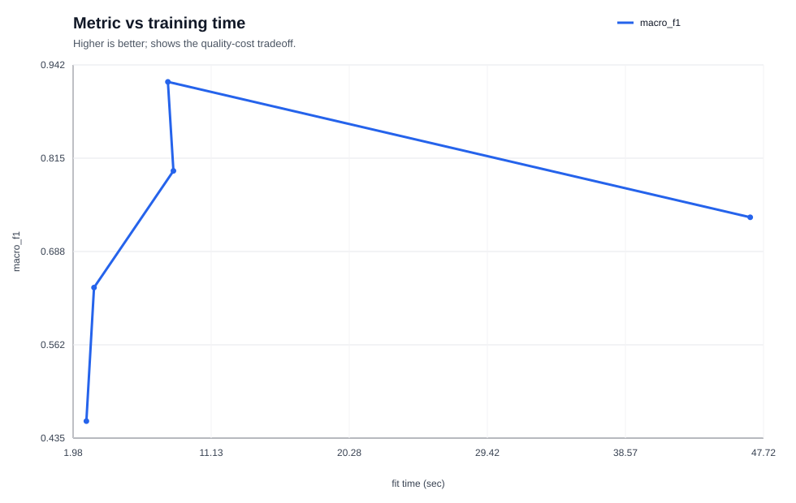

# 01 ML

이 트랙의 목표는 `표형 데이터 -> 전처리 -> baseline -> strong baseline -> metric 해석 -> failure analysis` 흐름을 몸에 익히는 것이다. 지금은 각 stage 폴더 안에 코드, 이론, 최신 artifact가 함께 있어 **하나씩 읽고 결과를 바로 확인할 수 있는 상태**다.

## 선행 권장

- 기본 루트에서는 [00_foundations](../00_foundations/README.md) 를 먼저 끝내고 들어온다.
- 특히 `01_tensor_shapes`, `02_activation_and_loss`, `05_gpu_memory_runtime` 을 보고 오면 feature matrix, loss, inference/runtime 해석이 더 잘 연결된다.
- 딥러닝 코어를 먼저 보고 싶다면 foundations를 끝낸 뒤 `02_deep_learning`의 핵심 unit와 `03_nlp_bridge`로 바로 갔다가, 나중에 다시 이 트랙으로 돌아와도 된다.

## 어디부터 보면 좋은가

1. 공통 이론: [THEORY.md](THEORY.md)
2. 전체 결과 인덱스: [RESULTS.md](RESULTS.md)
3. 아래 stage를 번호 순서대로 읽기

## stage 추천 순서

1. [01_tabular_classification](01_tabular_classification/README.md) — 가장 쉬운 applied baseline으로 metric과 confusion matrix 읽기
2. [02_tabular_regression](02_tabular_regression/README.md) — residual, parity plot, error 분포 보기
3. [03_model_selection_and_interpretation](03_model_selection_and_interpretation/README.md) — validation 설계와 해석 연결하기
4. [04_large_scale_tabular](04_large_scale_tabular/README.md) — 비용-성능 trade-off 읽기

## 전용 conda 환경

ML 트랙은 다른 단계와 의존성이 충돌할 수 있으므로 전용 환경 `btb-01-ml` 에서 실행한다.

- 최소 환경 스펙: [env/environment.yml](env/environment.yml)
- 실제 실행 환경 lock: [env/conda-linux-64.lock.txt](env/conda-linux-64.lock.txt)
- 환경/실행 가이드: [env/README.md](env/README.md)
- 환경 생성 스크립트: `bash 01_ml/env/create_env.sh`
- 전체 실행 진입점: `bash 01_ml/run_ml_track.sh`

## 폴더 구조

각 stage 폴더는 아래 구성으로 통일한다.

- `README.md`: 이 stage를 어떻게 공부할지 설명하는 입구 문서
- `THEORY.md`: 용어, 문제 정의, metric, 모델, 데이터셋, figure 읽는 법을 설명하는 이론 노트
- `dataset.py`: stage 전용 데이터 로딩/특징 생성
- `experiment.py`: 실제 실험 흐름, 전처리, 모델 학습, figure 생성, metric 저장
- `run_stage.py`: stage 단일 실행 entrypoint
- `artifacts/<run_id>/...`: metrics / config / predictions / figures / README / summary

## 실행 규칙

- stage별 코드는 각 폴더 안에서 바로 읽히도록 유지한다.
- 결과는 stage의 `artifacts/` 안에 바로 쌓는다.
- 숫자만 남기지 말고, metric과 figure 해석을 반드시 함께 남긴다.
- baseline 대비 무엇이 좋아졌는지와 어디서 틀렸는지를 같이 적는다.

실험 운영 규칙은 [../docs/01_experiment_playbook.md](../docs/01_experiment_playbook.md) 를 따른다.

## 빠르게 훑는 결과 미리보기

### 01 표형 분류

### 02 표형 회귀

### 03 모델 선택과 해석

### 04 대규모 표형 데이터

