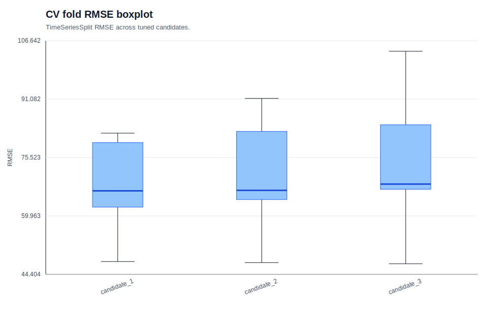
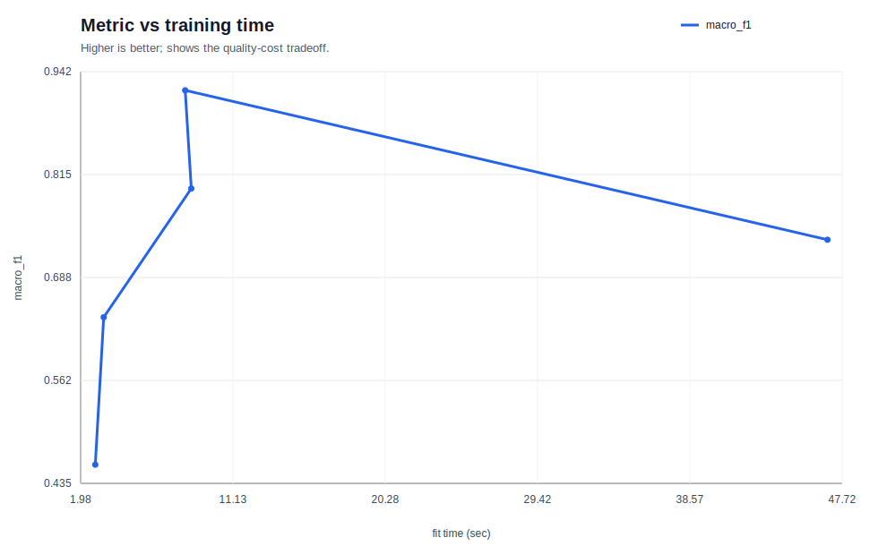

# 01 ML 결과 인덱스

이 문서는 ML 트랙의 최신 artifact를 한눈에 따라가기 위한 입구다.

## 실행 환경

- 전용 conda 환경: [env/README.md](env/README.md)
- 공통 이론 문서: [THEORY.md](THEORY.md)
- 전체 실행 명령: `CUDA_VISIBLE_DEVICES=0 conda run -n btb-01-ml python 01_ml/run_all.py --gpu 0`

## Stage 요약표

| Stage | 최고 모델 | 핵심 지표 | 링크 |
| --- | --- | --- | --- |
| 01. 표형 분류 | `random_forest` | `auprc`=0.7834, `auroc`=0.9105 | [이론](01_tabular_classification/THEORY.md) / [artifact](01_tabular_classification/artifacts/20260327-164446_adult-census-income_model-suite_s42/README.md) |
| 02. 표형 회귀 | `hist_gbdt` | `rmse`=0.4717, `mae`=0.3179 | [이론](02_tabular_regression/THEORY.md) / [artifact](02_tabular_regression/artifacts/20260327-164513_california-housing_model-suite_s42/README.md) |
| 03. 모델 선택과 해석 | `tuned_hist_gbdt` | `rmse`=60.0516, `mae`=38.1593 | [이론](03_model_selection_and_interpretation/THEORY.md) / [artifact](03_model_selection_and_interpretation/artifacts/20260327-164603_bike-sharing-hourly_tuned-hgbdt_s42/README.md) |
| 04. 대규모 표형 데이터 | `xgboost_gpu` | `macro_f1`=0.9192, `accuracy`=0.9377 | [이론](04_large_scale_tabular/THEORY.md) / [artifact](04_large_scale_tabular/artifacts/20260327-164831_covertype_large-scale-suite_s42/README.md) |

## 미리보기

## 01. 표형 분류

## 02. 표형 회귀

## 03. 모델 선택과 해석

## 04. 대규모 표형 데이터

