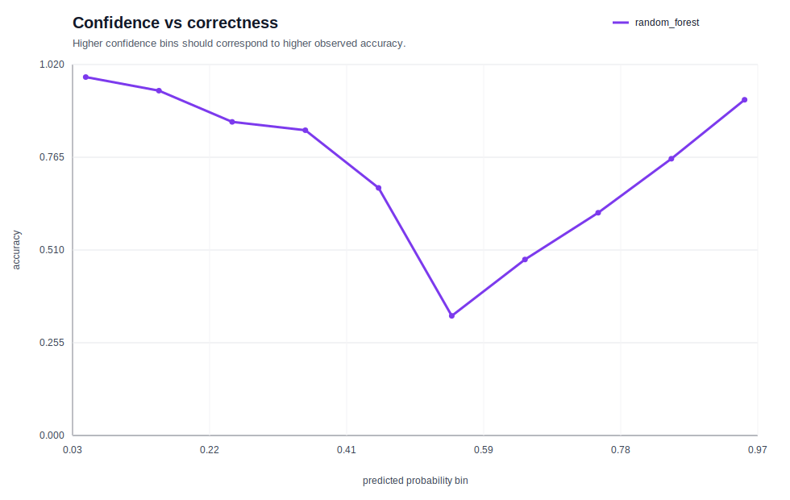

# 01. 표형 분류 결과 요약

## 한 줄 결론

- 과제: Adult Census Income 이진 분류
- 최고 모델: `random_forest`
- 핵심 지표: `auprc`=0.7834, `auroc`=0.9105, `f1`=0.6971, `accuracy`=0.8354
- 해석: 랜덤 포레스트가 분류 순위 품질(AUPRC)에서 가장 안정적이었고, 성별 slice에서 오차율 차이가 남았다.

## 이론 포인트

- 상세 이론 문서: [01. 표형 분류 THEORY](../../../../01_ml/01_tabular_classification/THEORY.md)

- 이 데이터는 positive class가 희소하므로 accuracy보다 AUPRC 해석이 더 중요하다.
- 확률 기반 분류는 threshold와 ranking을 분리해서 봐야 하며, AUROC/AUPRC와 F1은 서로 다른 질문에 답한다.
- calibration curve는 높은 확률 예측이 실제로도 높은 정답률을 가지는지 확인하게 해 준다.

## 모델 비교

| 모델 | AUPRC | AUROC | F1 | ACCURACY | FIT_SEC |
| --- | --- | --- | --- | --- | --- |
| random_forest | 0.7834 | 0.9105 | 0.6971 | 0.8354 | 1.70 |
| logistic_regression | 0.7657 | 0.9044 | 0.6724 | 0.8055 | 4.36 |
| gpu_mlp | 0.7569 | 0.9021 | 0.6851 | 0.8510 | 4.48 |
| dummy_prior | 0.2407 | 0.5000 | 0.0000 | 0.7593 | 0.00 |

## 결과 해석 / 실패 분석

- 고확신 오답 상위 사례의 성별 분포는 {'Male': 29, 'Female': 1} 로, 특정 demographic slice 편향 가능성을 시사했다.
- 상위 오답의 주요 학력 분포는 {'Bachelors': 11, 'Masters': 9, 'Doctorate': 5} 였고, 평균 연령은 44.9세, 평균 근무시간은 47.9시간이었다.
- 즉, 고학력·고근무시간 패턴을 소득 고구간으로 과신하는 경향이 남아 있었다.

## 결과 Figure

### pr_curve.svg

### roc_curve.svg

### confusion_matrix.svg

## 분석 Figure

### permutation_importance.svg

### error_slice_by_sex.svg

### confidence_vs_correctness.svg

## 다음 액션

- 최고 점수만 보지 말고, figure에서 드러난 실패 slice를 다음 실험 가설로 연결한다.
- 원시 산출물은 `runs/01_ml/01_tabular_classification/20260326-172429_adult-census-income_model-suite_s42/` 아래에서 확인할 수 있다.
