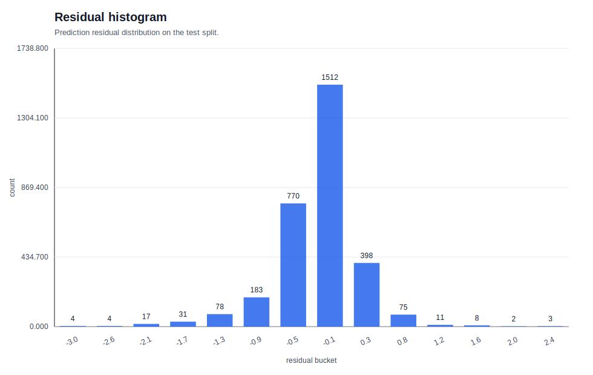
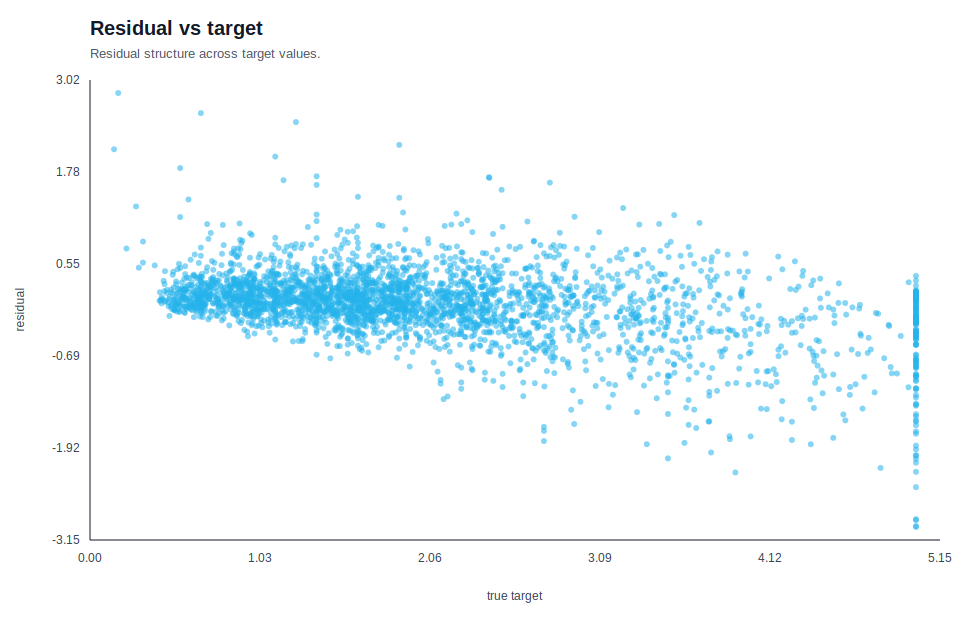
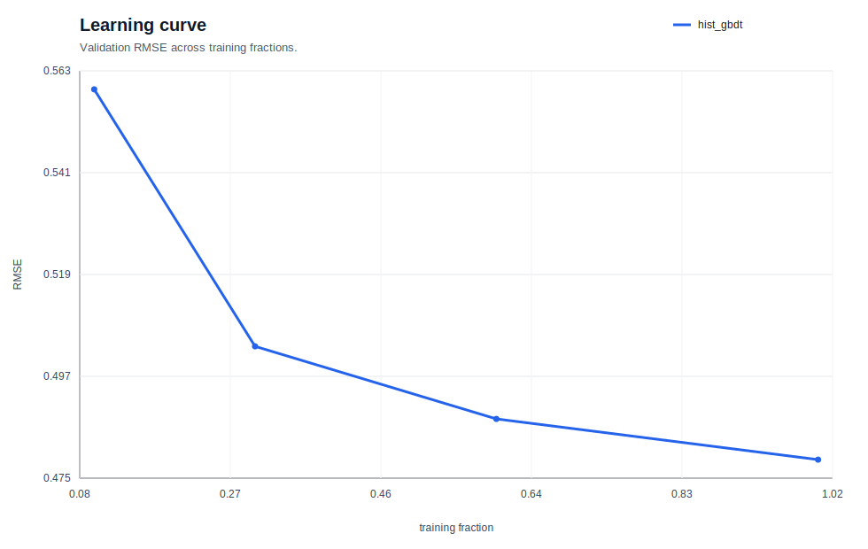
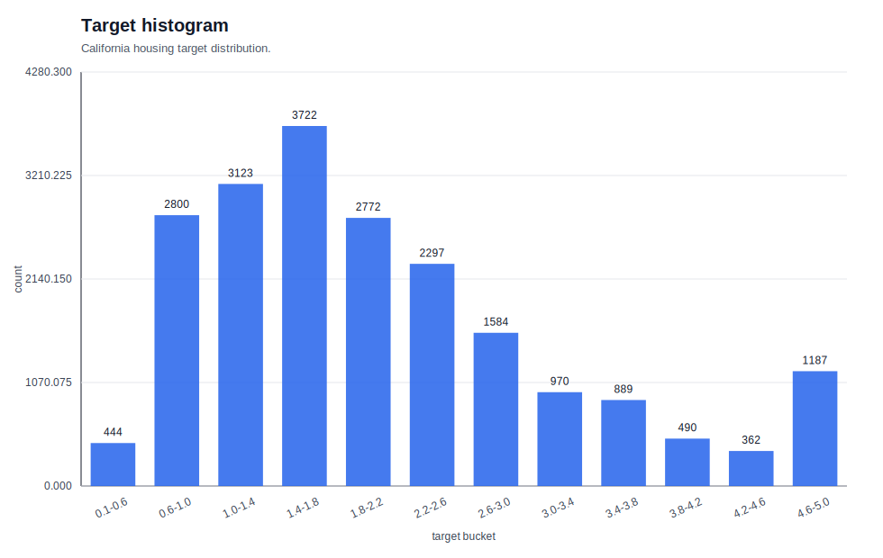
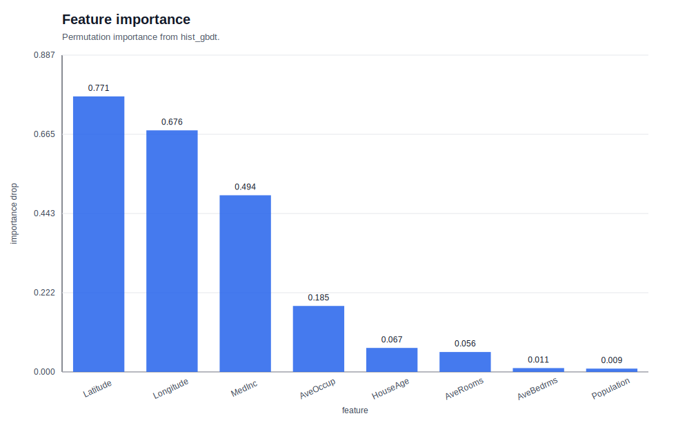
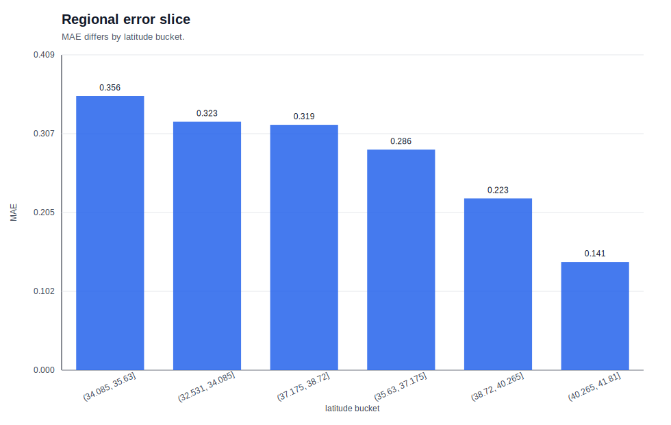
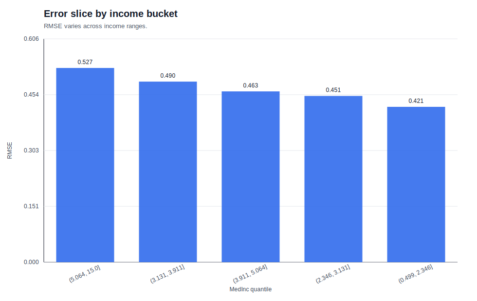
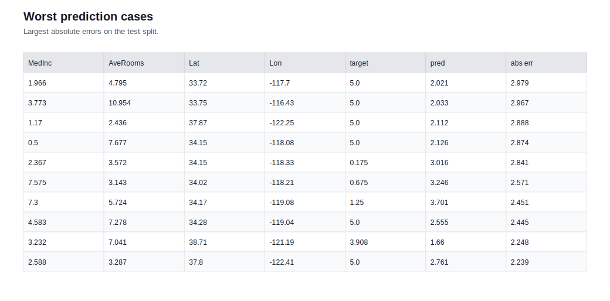

# 02. 표형 회귀 결과 요약

이 문서는 California Housing 회귀 실험을 **이론, 실험 설계, 결과, 실패 분석** 순서로 정리한 학습용 요약이다.
핵심은 “무슨 점수가 나왔는가”보다 **왜 그런 점수가 나왔는가**, **어디서 틀렸는가**, **어떤 그림을 같이 봐야 하는가**를 연결하는 데 있다.

## 한 줄 결론

- 과제: California Housing 회귀
- 최고 모델: `hist_gbdt`
- 핵심 지표: `rmse`=`0.4717`, `mae`=`0.3179`, `r2`=`0.8302`
- 해석: tree boosting이 선형 모델과 GPU MLP보다 더 잘 맞았고, 고가 주택과 특정 지역/소득 구간에서 residual이 크게 남았다.

## 이론 링크

- 상세 이론 문서: [THEORY.md](../../../../01_ml/02_tabular_regression/THEORY.md)

## 이론 포인트

- MAE는 평균 절대 오차이고, RMSE는 큰 오차를 더 강하게 벌한다.
- R²는 평균 예측 대비 설명력을 보여 주지만 tail error를 숨길 수 있다.
- residual은 예측과 실제의 차이이며, bias와 실패 구조를 찾는 핵심 도구다.
- parity plot, residual histogram, slice 분석을 함께 봐야 회귀를 제대로 해석할 수 있다.

## 왜 이론이 이런 형태로 발전했는가

회귀는 “얼마나 맞았는가”보다 “어디서 얼마나 틀렸는가”가 중요해지면서, 평균 오차 지표와 residual 진단이 함께 발전했다.
MAE는 이상치에 덜 민감한 직관적 지표로, RMSE는 큰 오차를 더 강하게 벌하는 위험 지표로, R²는 평균 기준선 대비 설명력을 보는 요약 지표로 자리 잡았다.

이번 실험에서는 이 세 관점을 모두 동시에 써야 했다.
평균 성능은 좋더라도, 고가 주택과 지역/소득 slice에서 구조적인 오차가 남았기 때문이다.

## 실험 설계

- 데이터셋: California Housing
- 분할: train / valid / test
- 비교 모델:
  - `DummyRegressor(strategy="mean")`
  - `LinearRegression`
  - `Ridge`
  - `RandomForestRegressor`
  - `HistGradientBoostingRegressor`
  - `GPU MLP`
- 공통 전처리:
  - 수치형 결측치 대체
  - linear/MLP 계열 표준화
  - tree 계열은 결측치 대체만 사용

## 모델 비교

| 모델 | RMSE | MAE | R2 | FIT_SEC |
| --- | --- | --- | --- | --- |
| hist_gbdt | 0.4717 | 0.3179 | 0.8302 | 1.56 |
| random_forest | 0.5146 | 0.3363 | 0.7979 | 0.52 |
| gpu_mlp | 0.5848 | 0.4032 | 0.7391 | 1.92 |
| ridge | 0.7329 | 0.5354 | 0.5901 | 0.04 |
| linear_regression | 0.7329 | 0.5354 | 0.5901 | 0.01 |
| dummy_mean | 1.1448 | 0.9031 | -0.0000 | 0.01 |

### 메트릭을 어떻게 읽어야 하는가

- `hist_gbdt`의 RMSE는 `dummy_mean` 대비 약 `58.8%` 낮다.
- `linear_regression` 대비 RMSE는 약 `35.6%` 낮다.
- `random_forest`보다도 더 낮다.
- `gpu_mlp`보다도 더 낮다.

즉, 이 데이터에서는 비선형 표형 모델이 필요하고, tree boosting이 가장 강한 기준선이다.

## 결과 해석 / 실패 분석

- 최악 예측 30개에서 평균 실제값은 `3.616`, 평균 예측값은 `2.489`였다.
- 최악 사례 중 `target > 4.5` 비중이 `43.3%`였다.
- 최악 사례 중 `target < 1.0` 비중도 `13.3%`였다.
- 해석: 모델이 극단값을 가운데로 끌어오는 regressing-to-the-mean 경향이 남아 있다.

### residual histogram에서 보이는 패턴

- residual이 0 근처에 모이지만, `-0.1` 근처 bin이 가장 높다.
- 즉, 전체적으로는 괜찮아 보여도 약한 과소추정 경향이 남아 있다.

### 지역 slice에서 보이는 패턴

- 남쪽에 가까운 위도 bucket일수록 MAE가 컸다.
- 가장 큰 bucket은 `(34.085, 35.63]`에서 `0.356`이다.
- 가장 작은 bucket은 `(40.265, 41.81]`에서 `0.141`이다.

### 소득 slice에서 보이는 패턴

- 소득 bucket에 따라 RMSE가 달라진다.
- 최고 소득 bucket `(5.064, 15.0]`의 RMSE는 `0.527`이다.
- 최저 소득 bucket `(0.499, 2.346]`의 RMSE는 `0.421`이다.
- 즉, 소득대별로 난이도가 다르다.

### feature importance에서 보이는 패턴

- `Latitude`와 `Longitude`가 가장 중요하다.
- 그다음이 `MedInc`다.
- 위치 + 소득 + 주거 구조가 함께 작동하는 문제라는 뜻이다.

## 결과 Figure

### parity_plot.svg

예측값과 실제값이 대각선에서 얼마나 벗어나는지 본다.
고가 구간에서 아래로, 저가 구간에서 위로 치우치면 평균으로 끌리는 bias가 있다는 뜻이다.

### residual_histogram.svg

오차 분포가 0 근처에 모이는지, 한쪽 꼬리가 긴지 본다.
이번 실험에서는 약한 과소추정 경향이 남아 있다.

### residual_vs_target.svg

target 값이 커질수록 residual이 어떻게 바뀌는지 본다.
tail에서 residual 폭이 커지고, 극단값에서 과소추정/과대추정이 함께 나타나는지 확인한다.

### learning_curve.svg

학습 데이터가 늘어날수록 검증 오차가 어떻게 변하는지 본다.
데이터가 더 필요했는지, 아니면 모델 구조가 더 중요했는지 판단하는 데 쓴다.

### target_histogram.svg

target 분포와 꼬리 구간을 본다.
California Housing은 tail이 강하고 상단 cap이 있어, 분포 자체가 단순하지 않다.

## 분석 Figure

### feature_importance.svg

어떤 feature가 예측에 가장 크게 기여했는지 보여 준다.
여기서는 위치 변수와 `MedInc`가 핵심이었다.

### regional_error_slice.svg

위도 구간별 MAE를 보여 준다.
전체 평균이 좋아도 지역별로 성능이 다를 수 있음을 확인시켜 준다.

### error_slice_by_income.svg

소득 구간별 RMSE 차이를 보여 준다.
지역 slice와는 다른 방향의 편차를 확인하는 데 유용하다.

### worst_prediction_cases.svg

가장 크게 틀린 샘플을 보여 준다.
고가 주택을 낮게 예측하거나, 아주 낮은 가격을 높게 예측하는 패턴을 확인할 수 있다.

## 실험 결론

이 실험은 “회귀는 숫자 하나로 끝나지 않는다”는 점을 보여 준다.
평균 지표가 좋아도 residual과 slice를 보면 tail과 지역성, 소득대별 편차가 남는다.
그래서 회귀 실험에서는 metric, residual, slice, feature importance를 한 묶음으로 읽어야 한다.

## 다음 가설

1. `log1p(target)` 변환이 tail 과소추정을 줄이는가?
2. 지역 bin 또는 상호작용 feature가 regional MAE를 줄이는가?
3. Huber loss나 quantile regression이 outlier와 tail에 더 강한가?
4. neighborhood 수준의 공간 feature를 넣으면 고가 주택 구간이 개선되는가?

## 최신 링크

- 이론: [THEORY.md](../../../../01_ml/02_tabular_regression/THEORY.md)
- 실행 결과: `runs/01_ml/02_tabular_regression/20260326-172452_california-housing_model-suite_s42/`
- 원시 예측: `runs/01_ml/02_tabular_regression/20260326-172452_california-housing_model-suite_s42/predictions/worst_predictions.csv`
