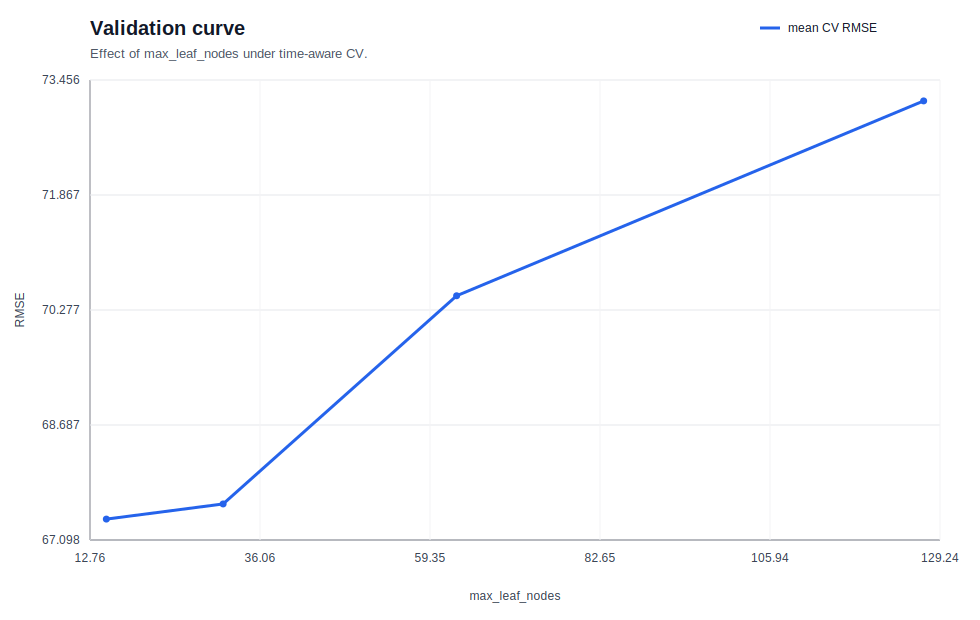
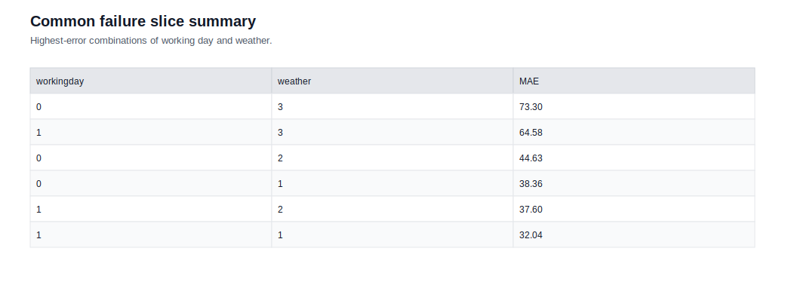

# 03. 모델 선택과 해석 결과 요약

## 한 줄 결론

- 과제: Bike Sharing 시계열성 count 회귀
- 최고 모델: `tuned_hist_gbdt`
- 핵심 지표: `rmse`=60.0516, `mae`=38.1593, `r2`=0.9258
- 해석: 시간축을 보존한 CV와 tuned HGBDT가 강력했고, 악천후/비근무일 조합이 가장 어려운 slice였다.

## 모델 비교

| 모델 | RMSE | MAE | R2 | FIT_SEC |
| --- | --- | --- | --- | --- |
| tuned_hist_gbdt | 60.0516 | 38.1593 | 0.9258 | - |
| poisson_baseline | 163.1814 | 120.1109 | 0.4522 | - |
| gpu_mlp | 164.3160 | 109.0213 | 0.4446 | - |

## 결과 Figure

### cv_fold_score_boxplot.svg

### validation_curve.svg

### top_feature_importance.svg

## 분석 Figure

### subgroup_metric_comparison.svg

### confidence_bin_plot.svg

### common_failure_slice_summary.svg

## 다음 액션

- 최고 점수만 보지 말고, figure에서 드러난 실패 slice를 다음 실험 가설로 연결한다.
- 원시 산출물은 `runs/01_ml/03_model_selection_and_interpretation/20260326-172503_bike-sharing-hourly_tuned-hgbdt_s42/` 아래에서 확인할 수 있다.
