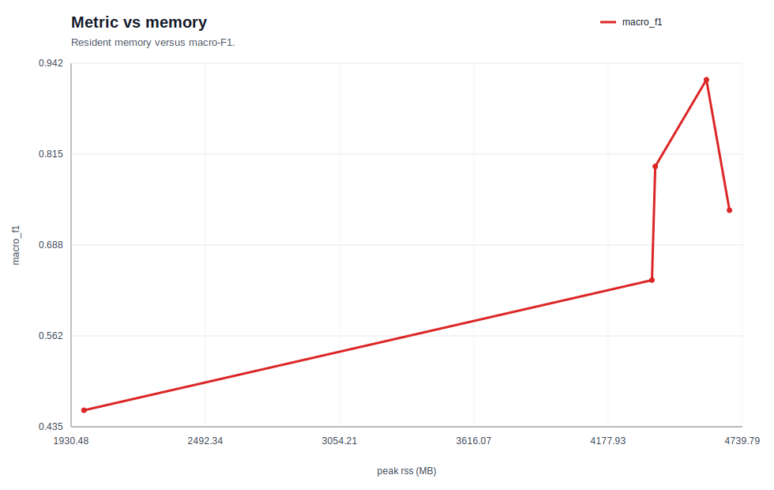
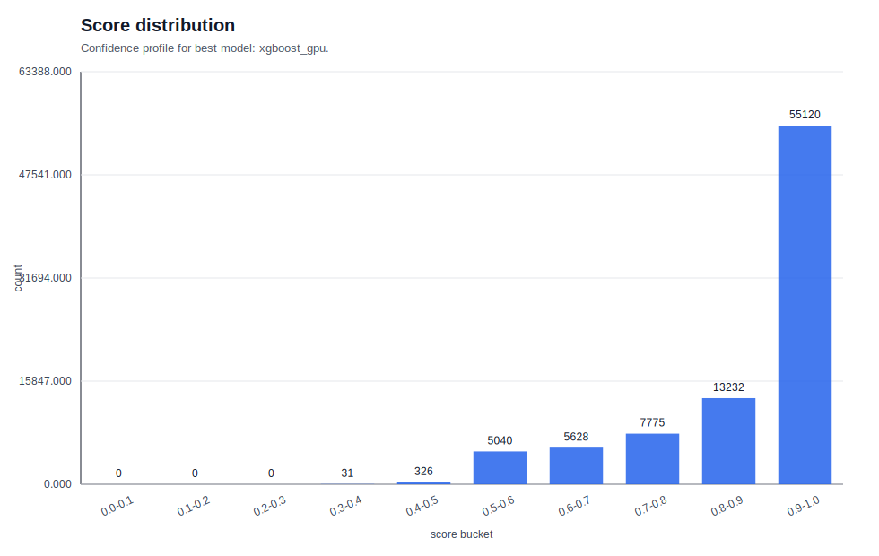
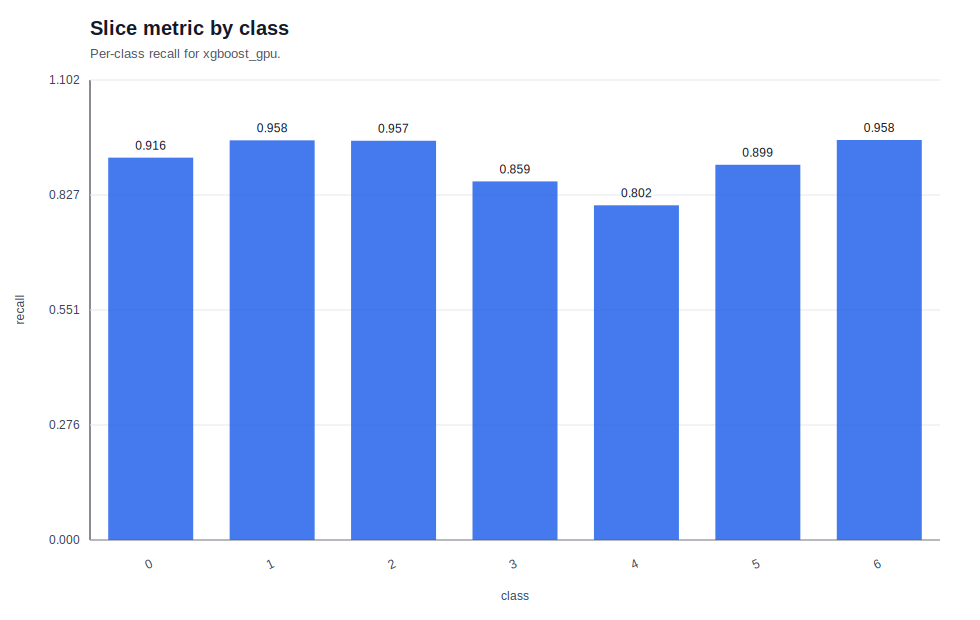

# 04. 대규모 표형 데이터 결과 요약

이 문서는 Covertype 대규모 다중분류 실험을 **이론 → 실험 설계 → 지표 → 실패 분석 → 다음 가설** 순서로 읽도록 정리한 공부노트다.
이번 stage의 핵심은 단순한 점수 나열이 아니라, **왜 large-scale tabular / macro metrics / cost-quality trade-off / GPU boosting 이론이 필요했는지**와 **artifact에서 실제로 무엇이 무너졌는지**를 함께 읽는 것이다.

## 읽는 순서

1. [이론 문서](../../../../01_ml/04_large_scale_tabular/THEORY.md)
2. 아래의 실험 결과 요약
3. 결과 Figure
4. 분석 Figure
5. 다음 실험 가설

## 한 줄 결론

- 과제: Covertype 대규모 다중분류
- 최고 모델: `xgboost_gpu`
- 핵심 지표: `macro_f1`=0.9192, `accuracy`=0.9377, `macro_recall`=0.9070, `mean_confidence`=0.8861
- 해석: accuracy는 높았지만, class별 recall과 confusion pattern을 함께 보지 않으면 중요한 실패를 놓칠 수 있었다.

## 왜 이 이론이 필요했나

### large-scale tabular

이 데이터는 단순히 "표형 데이터"가 아니라, **많은 샘플을 빠르게 반복 실험해야 하는 표형 데이터**다.
여기서는 성능이 좋아도 학습이 느리거나 메모리가 크면 실험 루프가 깨진다.
그래서 이론 문서는 품질만이 아니라 **속도와 메모리까지 같이 읽어야 한다**고 강조한다.

### macro metrics

artifact를 보면 class 0/1이 많이 등장하고 class 3은 희소하다.
이런 상황에서는 accuracy가 minority class의 실패를 가릴 수 있다.
그래서 macro-F1과 macro-recall이 필요하다.
즉, macro 지표는 **다수 class 편향을 누르고 class별 실패를 드러내는 도구**다.

### cost-quality trade-off

대규모 tabular에서는 점수만 높은 모델보다 **점수 대비 비용이 좋은 모델**이 더 중요하다.
이 stage는 fit time, predict time, peak memory를 같이 기록해서
- 더 좋은 점수를 얻는 데 드는 비용이 무엇인지
- 그 비용이 감당 가능한지
를 같이 본다.

### GPU boosting

tree boosting은 tabular에서 강력한 계열이지만, 큰 데이터에서는 CPU만으로 실험 속도가 부족할 수 있다.
GPU boosting은 histogram 기반 split 탐색과 병렬 연산을 이용해 이 문제를 해결하려고 등장했다.
이 stage에서는 GPU를 썼다는 사실보다, **강한 tree 계열을 더 좋은 비용 구조로 돌릴 수 있는가**가 중요했다.

## 이론 포인트

- 상세 이론 문서: [04. 대규모 표형 데이터 THEORY](../../../../01_ml/04_large_scale_tabular/THEORY.md)
- accuracy는 다수 class에 끌려가기 쉽기 때문에, 불균형 multiclass에서는 macro-F1과 macro-recall이 더 중요하다.
- throughput, fit time, predict time, peak memory는 "실험을 빨리 반복할 수 있는가"와 "운영 가능한가"를 보여 준다.
- GPU boosting은 강력한 strong baseline이지만, 전처리와 데이터 이동 비용까지 포함해 봐야 한다.

## 실험 해설

이번 실험은 다음 질문에 답하려고 설계했다.

- 선형 모델이 기본적인 경계를 잡는가?
- 얕은 tree와 histogram GBDT는 얼마나 개선하는가?
- GPU boosting은 추가 메모리 비용을 지불할 만한가?
- GPU MLP는 tabular에서 강한 비교군이 될 수 있는가?

비교 모델은 다음과 같다.

- `sgd_linear`: 빠른 약한 baseline
- `shallow_tree`: 얕은 비선형 baseline
- `hist_gbdt`: scikit-learn strong baseline
- `xgboost_gpu`: GPU boosting strong baseline
- `gpu_mlp`: neural network 대조군

## 모델 비교

| 모델 | MACRO_F1 | ACCURACY | MACRO_RECALL | MEAN_CONFIDENCE | FIT_SEC |
| --- | --- | --- | --- | --- | --- |
| xgboost_gpu | 0.9192 | 0.9377 | 0.9070 | 0.8861 | 7.94 |
| hist_gbdt | 0.7981 | 0.8365 | 0.7765 | 0.7849 | 8.22 |
| gpu_mlp | 0.7369 | 0.8383 | 0.7046 | 0.8101 | 29.13 |
| shallow_tree | 0.6394 | 0.7797 | 0.5806 | 0.6667 | 3.36 |
| sgd_linear | 0.4578 | 0.7090 | 0.4455 | 0.6960 | 2.62 |

## 지표 해석

### 1. xgboost_gpu가 가장 좋았던 이유

- macro-F1이 `0.9192`로 가장 높았다.
- accuracy도 `0.9377`로 가장 높았다.
- macro-recall도 `0.9070`으로 균형이 좋았다.
- fit time은 `7.94s`로 hist_gbdt와 비슷한 수준이면서 더 높은 품질을 냈다.
- predict time도 `0.10s`로 hist_gbdt보다 짧았다.

즉, 이 실험에서는 `xgboost_gpu`가 **품질과 속도의 균형**을 가장 잘 맞췄다.

### 2. hist_gbdt가 strong baseline인 이유

- macro-F1 `0.7981`, accuracy `0.8365`는 linear/tree 약한 baseline보다 분명히 좋았다.
- 하지만 class별 recall 편차가 남아 있어, 아직 경계가 충분히 안정적이라고 보긴 어렵다.
- peak RSS가 `4375MB` 수준이라, 규모가 커질수록 메모리도 꾸준히 신경 써야 한다.

### 3. gpu_mlp가 기대보다 약했던 이유

- macro-F1이 `0.7369`로 tree 계열보다 낮았다.
- fit time이 `29.13s`로 가장 느렸다.
- peak RSS는 `4685.8MB`, peak GPU memory는 `207.2MB`였다.

이 결과는 "GPU를 쓴다 = tabular에서 무조건 이긴다"가 아니라는 점을 보여 준다.
이론적으로도 tabular에서는 feature engineering과 split structure를 잘 잡는 tree 계열이 더 강한 경우가 많다.

### 4. light baseline과 strong baseline의 차이

- `sgd_linear`는 빠르지만 macro-F1이 `0.4578`로 낮다.
- `shallow_tree`는 선형보다 나아졌지만 여전히 strong baseline과는 큰 차이가 있다.

이 비교는 "이 데이터가 단순 선형 분리 문제가 아니다"라는 신호다.

## 결과 해석 / 실패 분석

### 1. class별 recall

최신 예측 샘플 기준 class별 recall은 다음과 같다.

- class 0: `0.9161`
- class 1: `0.9576`
- class 2: `0.9566`
- class 3: `0.8592`
- class 4: `0.8020`
- class 5: `0.8990`
- class 6: `0.9584`

여기서 핵심은 class 4가 가장 어렵고, class 6은 가장 잘 맞는다는 점이다.
따라서 전체 accuracy가 높아도 class 4처럼 약한 class는 계속 남는다.

### 2. confusion pair

가장 큰 confusion pair 상위는 다음과 같다.

- `(0 -> 1)`: `2562`
- `(1 -> 0)`: `1573`
- `(4 -> 1)`: `257`
- `(5 -> 2)`: `171`
- `(2 -> 5)`: `121`

이 결과는 두 가지를 말해 준다.

1. class 0과 1은 경계가 가장 헷갈린다.
2. 일부 minority class는 dominant class로 흡수되는 경향이 있다.

즉, 이 문제는 단순히 "맞고 틀리고"가 아니라, **어떤 class boundary가 붕괴하는가**를 보는 문제다.

### 3. 샘플 분포가 해석에 주는 의미

test 샘플의 label 분포를 보면 class 1과 0이 압도적으로 많고, class 3은 매우 희소하다.
이 구조에서는 accuracy가 높아도 소수 class의 실패가 가려질 수 있다.
그래서 macro 지표를 계속 봐야 한다.

### 4. 메모리와 속도 관점의 해석

- `xgboost_gpu`: 가장 좋은 성능과 짧은 예측시간, 다만 peak RSS는 `4589MB`로 더 높다.
- `hist_gbdt`: 약간 더 가볍지만 성능이 확실히 낮다.
- `gpu_mlp`: 가장 느리고 메모리도 가장 크다.

따라서 이 실험에서는 **xgboost_gpu가 품질-비용 균형의 최적점**에 가장 가까웠다.

## 결과 Figure

### metric_vs_training_time.svg

### metric_vs_memory.svg

### score_distribution.svg

## 분석 Figure

### slice_metric_by_class.svg

### throughput_bottleneck_summary.svg

### sampling_strategy_performance.svg

## 다음 실험 가설

1. class 0/1 confusion을 줄이기 위해 더 세밀한 feature engineering을 추가한다.
2. class 4의 recall을 올리기 위해 class-balanced loss 또는 resampling을 시도한다.
3. xgboost_gpu의 강점을 유지하면서 memory를 줄이는 설정을 탐색한다.
4. HIGGS 같은 더 큰 데이터에서 같은 문서 구조가 유지되는지 확인한다.

## 한 문장 정리

이 실험은 "대규모 tabular에서는 정확도만 보지 말고, macro 지표와 비용 지표를 함께 읽어야 한다"는 사실을 보여 준다.
