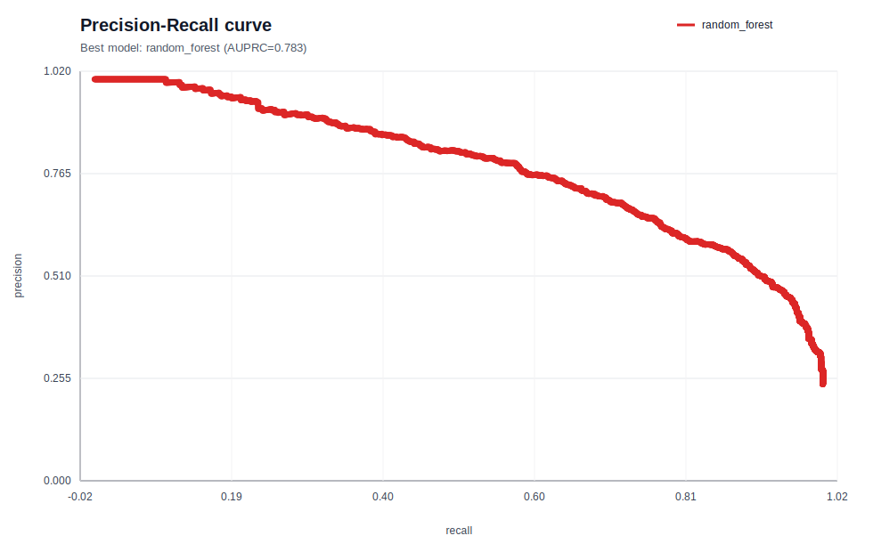
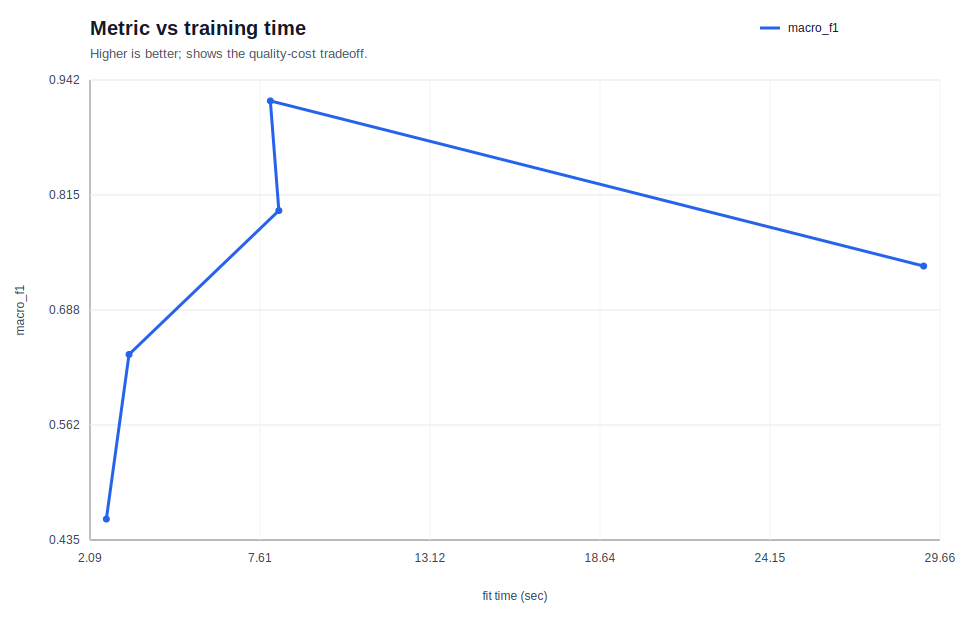

# 01 ML 리포트 인덱스

ML 트랙 전체 실행 결과를 한 눈에 보기 위한 요약 문서다.

## 실행 환경

- 전용 conda 환경: [`01_ml/env/README.md`](../../01_ml/env/README.md)
- 실행 명령: `CUDA_VISIBLE_DEVICES=0 conda run -n btb-01-ml python scripts/01_ml/run_all.py --gpu 0`
- 원시 산출물: `runs/01_ml/...`

## Stage 요약표

| Stage | 최고 모델 | 핵심 지표 | 링크 |
| --- | --- | --- | --- |
| 01. 표형 분류 | `random_forest` | `auprc`=0.7834, `auroc`=0.9105 | [20260326-172429_adult-census-income_model-suite_s42](01_tabular_classification/20260326-172429_adult-census-income_model-suite_s42/README.md) |
| 02. 표형 회귀 | `hist_gbdt` | `rmse`=0.4717, `mae`=0.3179 | [20260326-172452_california-housing_model-suite_s42](02_tabular_regression/20260326-172452_california-housing_model-suite_s42/README.md) |
| 03. 모델 선택과 해석 | `tuned_hist_gbdt` | `rmse`=60.0516, `mae`=38.1593 | [20260326-172503_bike-sharing-hourly_tuned-hgbdt_s42](03_model_selection_and_interpretation/20260326-172503_bike-sharing-hourly_tuned-hgbdt_s42/README.md) |
| 04. 대규모 표형 데이터 | `xgboost_gpu` | `macro_f1`=0.9192, `accuracy`=0.9377 | [20260326-172723_covertype_large-scale-suite_s42](04_large_scale_tabular/20260326-172723_covertype_large-scale-suite_s42/README.md) |

## 01. 표형 분류

- 과제: Adult Census Income 이진 분류
- 요약: 랜덤 포레스트가 분류 순위 품질(AUPRC)에서 가장 안정적이었고, 성별 slice에서 오차율 차이가 남았다.

## 02. 표형 회귀

- 과제: California Housing 회귀
- 요약: HistGradientBoostingRegressor가 가장 낮은 RMSE를 기록했고, 고가 주택/특정 지역에서 residual이 커졌다.

## 03. 모델 선택과 해석

- 과제: Bike Sharing 시계열성 count 회귀
- 요약: 시간축을 보존한 CV와 tuned HGBDT가 강력했고, 악천후/비근무일 조합이 가장 어려운 slice였다.

## 04. 대규모 표형 데이터

- 과제: Covertype 대규모 다중분류
- 요약: 대규모 데이터에서는 비용 대비 성능 비교가 핵심이었고, class별 recall 편차를 함께 봐야 했다.

